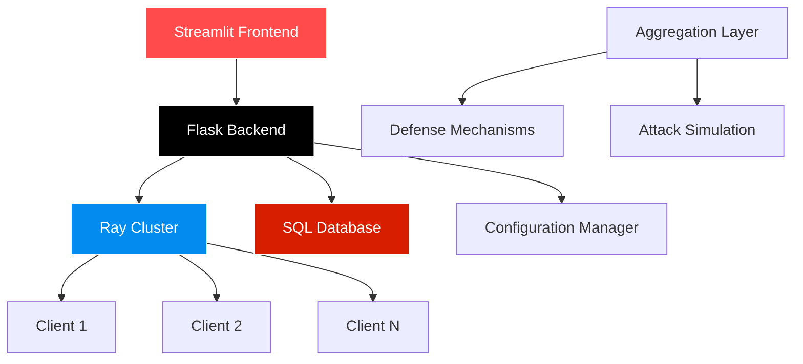

# 🚀 FL Simulator

<div align="center">


*A comprehensive federated learning simulation platform for research and experimentation*


</div>

---

## 🌟 Overview

FL Simulator is a cutting-edge federated learning simulation platform designed for both academic research and industrial applications. Built with modern technologies and best practices, it enables researchers to explore the intersection of federated learning and adversarial robustness through scalable, distributed simulations.

## ✨ Key Features

### 🔥 **Scalable Architecture**
- **Distributed Training**: Leverages Ray for parallel client training to minimize run-times
- **Modular Design**: Easily extensible with custom attack methods, defense mechanisms, datasets, and models
- **High Performance**: Optimized for both CPU and GPU environments

### 🛡️ **Comprehensive Security Testing**
- **Advanced Attack Schemes**:
  - Label Flip Attacks
  - Min-Max & Min-Sum Attacks
  - Krum & Trim Attacks
  - Gaussian Noise Attacks
  - Sign Flip Attacks
  - No Attack (clean training baseline)

- **Robust Defense Mechanisms**:
  - **FedAvg** - Standard federated averaging
  - **KRUM** - Byzantine-robust aggregation
  - **MEDIAN** - Coordinate-wise median
  - **TRIM_MEAN** - Trimmed mean aggregation
  - **KeTS** - Trust-score based defense
  - **FLTRUST** - Server-assisted robust aggregation
  - Custom variants for research purposes

### 🔐 **Privacy Protection**
- **Differential Privacy**: Built-in integration with [Opacus](https://opacus.ai/) for DP-SGD
- **Configurable Privacy Budgets**: Fine-tune privacy-utility trade-offs
- **Local Privacy**: Client-side differential privacy implementation

### 📊 **Rich Dataset Support**
- **Tabular Data**: `kdd-cup-1999`, `adult-census-income`, `covtype`
- **Image Data**: `MNIST`, `Fashion-MNIST`, `CIFAR-10`
- **Flexible Partitioning**: IID and Non-IID data distribution strategies

### 🎯 **Interactive Interface**
- **Streamlit Frontend**: User-friendly web interface for configuration and monitoring
- **Real-time Visualization**: Live training metrics and performance dashboards
- **Historical Analysis**: Query and analyze past experiment results

## 🏗️ Architecture

<div align="center">



</div>

## 🚀 Quick Start

### Prerequisites

<div align="center">


</div>

- Python 3.10+
- Docker (optional)
- 8GB+ RAM recommended

### 📦 Installation

1. **Clone the Repository**
   ```bash
   git clone <repository_url>
   cd FL_Simulator
   ```

2. **Create Virtual Environment**
   ```bash
   # Linux/macOS
   python -m venv venv
   source venv/bin/activate
   
   # Windows
   python -m venv venv
   venv\Scripts\activate
   ```

3. **Install Dependencies**
   ```bash
   pip install -r requirements.txt
   ```

### 🏃‍♂️ Running Locally

1. **Start the Backend**
   ```bash
   python backend/main_bp.py
   ```

2. **Launch the Frontend**
   ```bash
   streamlit run streamlit_app.py
   ```

3. **Access the Application**
   - Open your browser and navigate to `http://localhost:8501`

### 🐳 Docker Deployment

```bash
docker-compose up --build
```

**Access Points:**
- Streamlit App: `http://localhost:8501`
- Backend API: As configured in docker-compose.yml

## ⚙️ Configuration

The platform uses a YAML-based configuration system with comprehensive parameter control:

### 🎛️ **Model Configuration**
- **Architectures**: FCMNIST, FNet, Adult, COVERTYPE, TinyVGG
- **Optimization**: SGD, Adam, AdamW with configurable hyperparameters
- **Regularization**: Weight decay, momentum, learning rate scheduling

### 📈 **Training Parameters**
- **Federated Settings**: Number of clients, sampling strategies, epochs
- **Learning Configuration**: Learning rates, batch sizes, local updates
- **Privacy Settings**: DP-SGD parameters, noise multipliers

### 🔧 **Security Configuration**
- **Attack Types**: Configurable attack intensity and target selection
- **Defense Strategies**: Aggregation method selection and tuning
- **Trust Management**: Dynamic trust score updates and thresholds

## 📊 Technology Stack

<div align="center">

| Component | Technology | Purpose |
|-----------|------------|---------|
|  | **PyTorch** | Deep learning framework |
|  | **Ray** | Distributed computing |
|  | **Streamlit** | Interactive frontend |
|  | **Flask** | REST API backend |
|  | **SQLAlchemy** | Database ORM |
|  | **Opacus** | Differential privacy |
|  | **NumPy** | Numerical computing |
|  | **Pandas** | Data manipulation |

</div>

## 📈 Performance Metrics

The platform provides comprehensive logging and analysis capabilities:

- **Training Metrics**: Loss curves, accuracy progression, convergence analysis
- **Security Metrics**: Attack success rates, defense effectiveness
- **System Metrics**: Training time, resource utilization, scalability benchmarks
- **Privacy Metrics**: Privacy budget consumption, utility preservation

## 🧪 Research Applications

FL Simulator is designed for cutting-edge research in:

- **Federated Learning Algorithms**: New aggregation strategies and optimization methods
- **Adversarial Robustness**: Novel attack vectors and defense mechanisms  
- **Privacy-Preserving ML**: Differential privacy and secure aggregation techniques
- **System Optimization**: Scalability and efficiency improvements

## 🤝 Contributing

We welcome contributions from the research community!

### How to Contribute
1. 🍴 Fork the repository
2. 🌿 Create a feature branch (`git checkout -b feature/amazing-feature`)
3. 💻 Commit your changes (`git commit -m 'Add amazing feature'`)
4. 📤 Push to the branch (`git push origin feature/amazing-feature`)
5. 🔄 Open a Pull Request

### Development Guidelines
- Follow PEP 8 style guidelines
- Include comprehensive docstrings
- Add unit tests for new features
- Update documentation as needed

## 📚 Documentation

- **API Reference**: Detailed endpoint documentation
- **Configuration Guide**: Complete parameter reference
- **Research Papers**: Implementation details and experimental results
- **Tutorials**: Step-by-step usage examples

## 📄 License

This project is licensed under the MIT License - see the LICENSE file for details.

## 🙏 Acknowledgments

- **PyTorch Team** for the excellent deep learning framework
- **Ray Project** for enabling distributed computing
- **Streamlit** for the intuitive web interface
- **Opacus Team** for differential privacy tools
- **Research Community** for federated learning advances

## 📞 Support

- **Issues**: GitHub Issues
- **Discussions**: GitHub Discussions
- **Documentation**: Project Wiki
- **Email**: [Contact Email](mailto:contact@example.com)

---

<div align="center">

**⭐ Star this repository if you find it useful!**

*FL Simulator - Empowering federated learning research through advanced simulation capabilities*


</div>